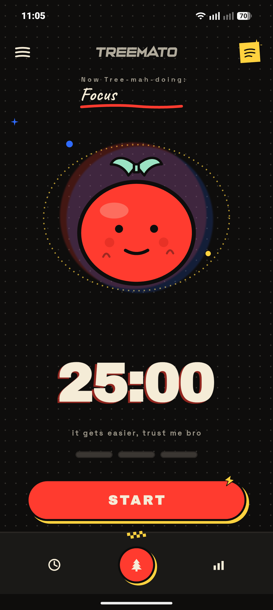
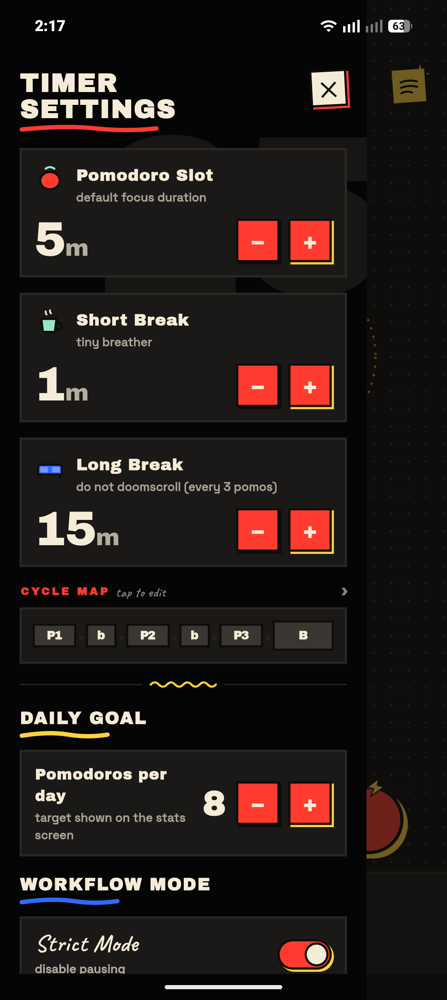
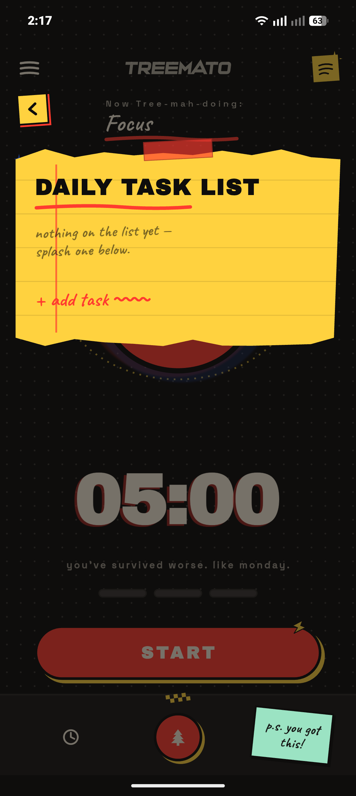
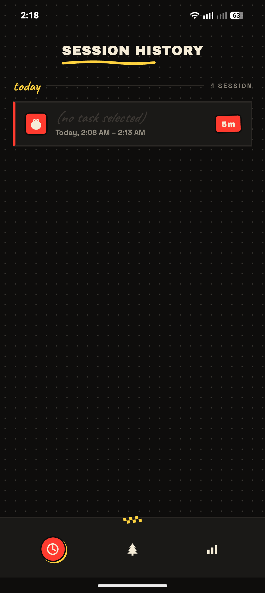
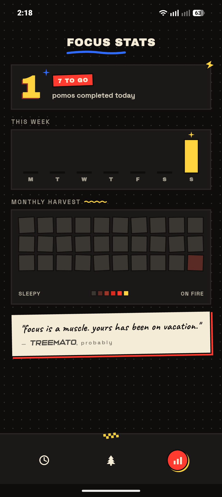

# Treemato

A personal Pomodoro & focus tracker for Android, built with Flutter.

Treemato is offline-first, opinionated, and small on purpose. It is the Pomodoro app I wanted on my own phone — a single screen for the timer, a list for what I am working on today, and two quiet pages of history and stats so the streak does the nagging instead of a notification.

<!-- SCREENSHOT: hero shot of the timer screen -->
<p align="center">
  
</p>

---
This project is licensed under the GNU General Public License v3.0 - see the LICENSE file for details.

## Core Philosophy

**Quirky, but utilitarian.** Every visual flourish — the tomato mascot, the lemon checker strip, the hand-drawn icons, the suitcase-entrance modal — is there to make a perfectly ordinary 25-minute countdown feel like an event worth showing up for. Nothing on screen is decoration alone; every element either tells you where you are in the cycle or invites you to do the next thing.

**One screen, one job.** The timer is the home. The task list slides up from it. Settings slide in from the side. History and stats sit on the other two tabs and never interrupt. There are no modals begging for attention, no settings buried four levels deep, no premium upsell.

**Offline by design.** Your sessions, your tasks, and your settings live in a local Hive database on your phone — nothing leaves the device. Even the fonts ship with the APK; the app never makes a network call.

**Small surface, deliberate friction.** Pause exists, but Strict Mode disables it. Skipping a pomodoro requires a deliberate freeze gesture, not a stray tap. The app makes the easy thing easy and the regrettable thing slightly harder.

---

## Workflow Guide

### 1. Set your slot durations

Open the settings drawer from the top-left handle. You get three knobs:

- **Pomodoro Slot** : your default focus duration (typical: 25 min).
- **Short Break** : the tiny breather between focus slots.
- **Long Break** : the longer reset that fires automatically every third pomodoro.

Below the durations: a **Daily Goal** dial (how many pomodoros you want to complete today), a **Workflow Mode** toggle for **Strict Mode** (which disables pausing while a slot is running), and a master **sound** switch.

<!-- SCREENSHOT: settings drawer -->
<p align="center">
  
</p>

---

### 2. Add what you'll work on

From the timer screen, **flick upwards** anywhere on the body, or tap the sticky-note icon. The Daily Task List slides up as a torn-paper sheet — type a task, hit return, and pick how many pomodoros you expect it to take.

The task you mark **active** is the one that gets credited each time a focus slot completes. You can change the active task at any time; the count decrements automatically when its pomodoros are spent.

<!-- SCREENSHOT: daily task list bottom sheet -->
<p align="center">
  
</p>

---

### 3. Run a slot

Tap **START** on the timer. The active task's name replaces the phase label, the mascot starts orbiting, and the countdown takes over.

- **Pause / Resume** : tap the centre control (disabled if Strict Mode is on).
- **Freeze gesture** : long-press the timer to "ice" the current slot. When the freeze completes, you can either **SKIP THIS ONE** (close the slot and move on, recording a skipped pomodoro) or **RESET** (start the same slot fresh). Tap outside to back out.
- **Cycle map** : three tomato pips at the top show where you are in the focus-break-focus-break-focus-longbreak cycle.

<!-- SCREENSHOT: timer running + freeze decision modal -->
<p align="center">
  
</p>

---

### 4. Check the receipts

- **History tab (left)** : every completed pomodoro slot, grouped by day, with the task it belonged to.
- **Stats tab (right)** : today's pomodoro count against the daily goal, a recent-days bar chart, and totals.

<!-- SCREENSHOT: history screen -->
<p align="center">
  
</p>

<!-- SCREENSHOT: stats screen -->
<p align="center">
  
</p>

---

## Tech

- **Flutter 3.6+ / Dart**
- **Provider** for state, **Hive** for local persistence
- **flutter_foreground_task** for background-correct timing
- **audioplayers** for chimes and screen SFX
- **fl_chart** for the stats bar chart
- **google_fonts** with runtime fetching disabled — fonts are bundled

## Build

```bash
flutter pub get
flutter pub run build_runner build --delete-conflicting-outputs
flutter run                  # debug on a connected device
flutter build apk --release  # release APK
```
